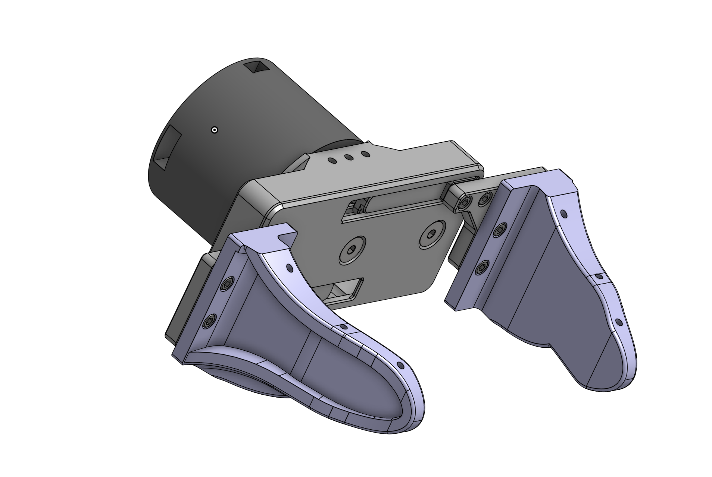
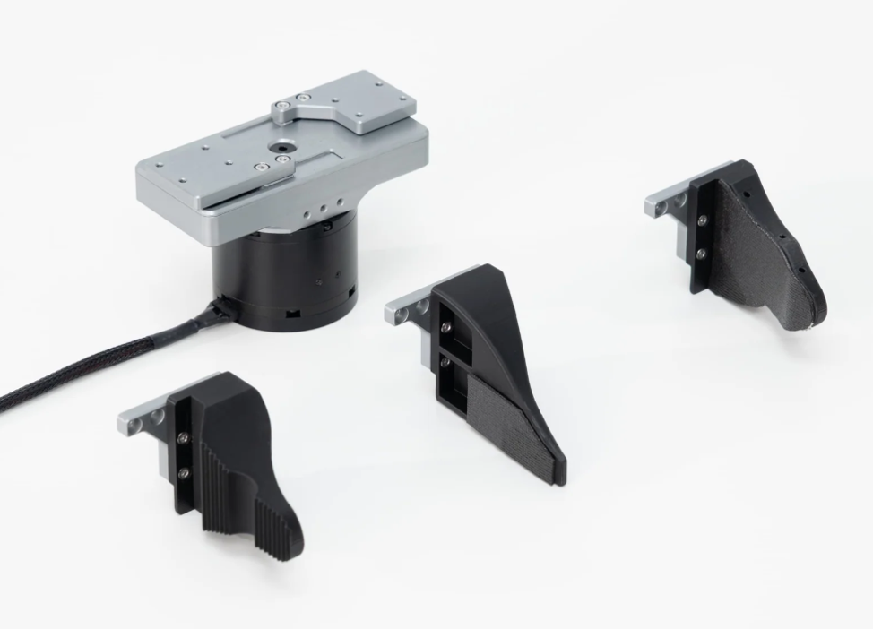

# Anvil Gripper

## Gripper Fingers

We include 3D files for three different types of gripper fingers:

- 1 pair of fine-tip flange
- 1 pair of wide-tip flange
- 1 pair of toothed flange

## CAD Files

All CAD files (STEP format) are committed directly to this repository:

- `gripper_base.stp`
- `left_finger_mount.stp`
- `right_finger_mount.stp`
- `wide_tip_flange_left.stp`
- `wide_tip_flange_right.stp`
- `fine_tip_flange_left.stp`
- `fine_tip_flange_right.stp`
- `toothed_flange_left.stp`
- `toothed_flange_right.stp`
- `camera.stp`

## Online Viewer

[Check out the models online here](https://cad.onshape.com/documents/a4ea09ac891d3e7a10ca9128/w/d988c9d914d08a3f387bc9c2/e/584ae1d20b0bc3b6434ee4dd?renderMode=0&uiState=69e145c594e20a041f8c7513)

## License
CERN Open Hardware License Version 2 - Strongly Reciprocal
Copyright 2026 Anvil Robotics
